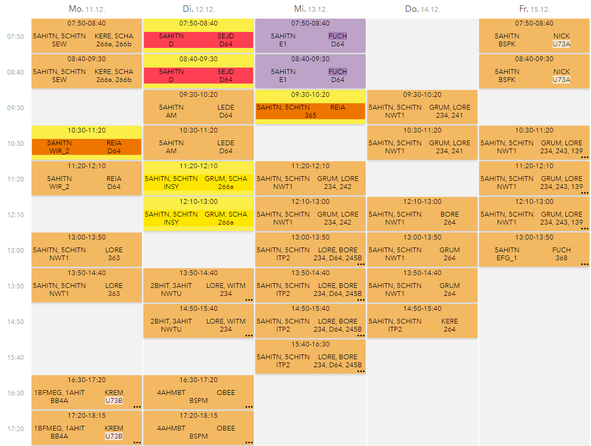
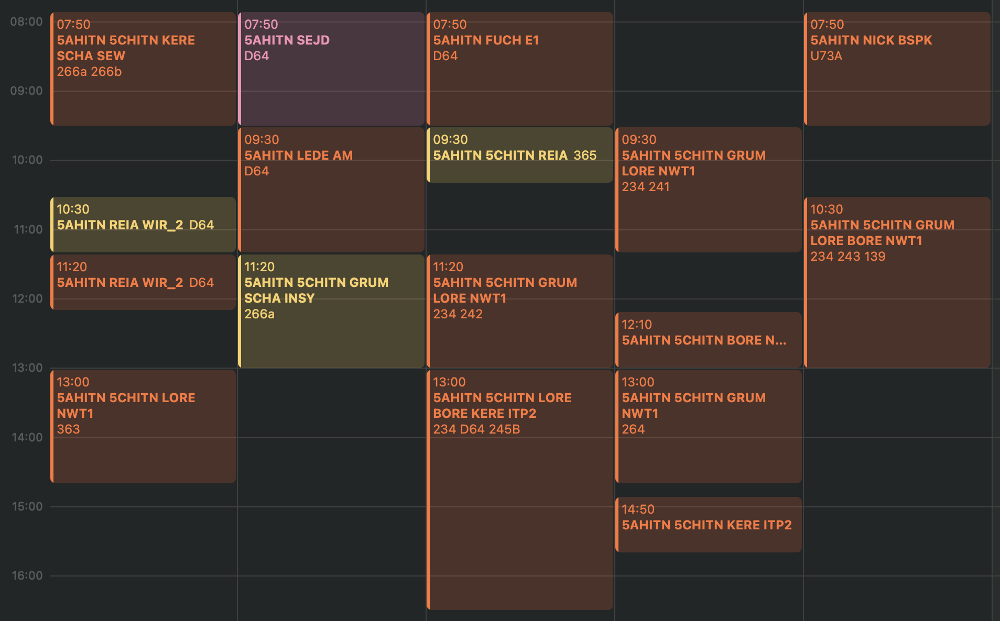

# Webunits Calendar Colors

## Problem

Webunits is the primary program used for school timetable management in Austria🇦🇹. It is a web application where students can view their timetable and teachers can manage their classes. Updates to the timetable are automatically pushed to the students' devices which makes it very useful.

Special occurences like exams, events or rescheduled classes are marked with special colors. In the web application it looks something like this:

### Web Application

Since using the web application itself is a bit tedious, many people use a featue which allows them to export their timetable as a calendar url. This url can then be imported into any calendar application. This is what it looks like in the macOS calendar app:

### macOS Calendar App

As you can see, the extra color information is lost and replaced by information in square brackets. The aim of this little script is to get the color info back into the calendar app. Here is what it looks like after using the script:

### macOS Calendar App with colors

## Usage

### Prerequisites

- Google Calendar
- An empty Google Sheet
- Empty Calendars in Google Calendar for each color you want to use
- Your personal Webunits calendar url imported in Google Calendar

### Setup

1. Create a new Apps Script in the Google Sheet
2. Add the Calendar Service
3. Copy the code from `cron.js` into the script
4. Change the calendar names and event identifiers to match your needs
5. Run the script once to authorize it
6. Create a new trigger for the script to run every hour
7. Enjoy your colorful calendar
